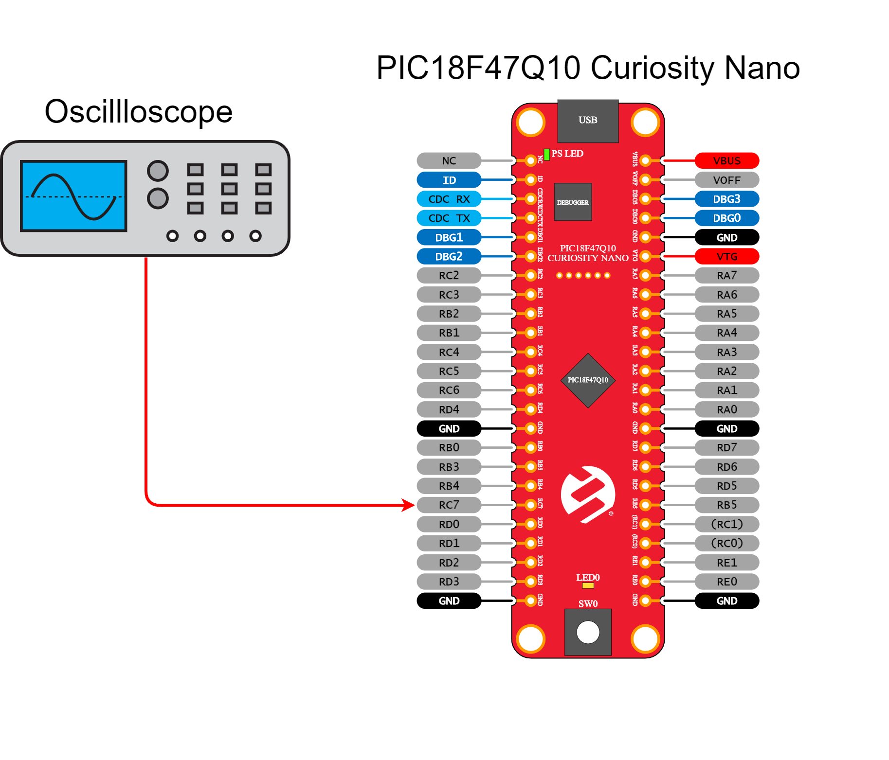
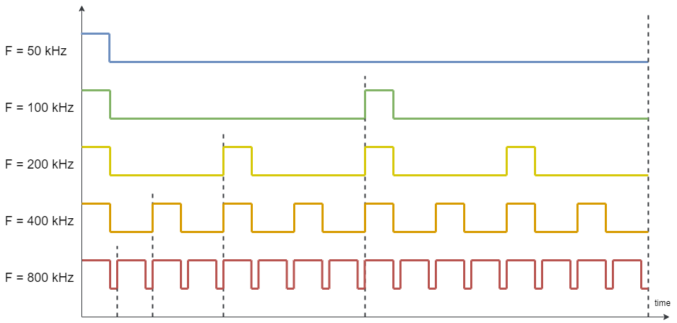

 <article class="markdown-body entry-content p-3 p-md-6" itemprop="This needs to locked down and 'never' changed">

# PIC18F47Q10 PWM Constant on-time

## Objective:
This repository contains an example of MCC generated code for PWM as described in [*TBxxxx - Getting Started with PWM on PIC18*](https://www.microchip.com/) document from Microchip.
 The PIC18F47Q10 features four 10-bit PWM generators. This example describes how to configure the CCP2 peripheral in conjunction with TMR4 to produce a PWM signal with variable frequency and constant on-time.
 Two GPIO pins are used. RE2 as an input to read the on-board button for controlling the demo and RC7 as a PWM output.

## Related Documentation
- [TBxxxx - Getting Started with Timers/Counters on PIC18](http://www.microchip.com/)
- [PIC18-Q10 Product Family Page](https://www.microchip.com/design-centers/8-bit/pic-mcus/device-selection/pic18f-q10-product-family)
- [PIC18F47Q10 Data Sheet](http://ww1.microchip.com/downloads/en/DeviceDoc/40002043D.pdf)
- [PIC18F47Q10 Code Examples on GitHub](https://github.com/microchip-pic-avr-examples?q=pic18f47q10-cnano)

## Software Used
- MPLAB® X IDE 5.30 or newer [(microchip.com/mplab/mplab-x-ide)](http://www.microchip.com/mplab/mplab-x-ide)
- MPLAB® XC8 2.10 or newer [(microchip.com/mplab/compilers)](http://www.microchip.com/mplab/compilers)
- MPLAB® Code Configurator (MCC) 3.95.0 or newer [(microchip.com/mplab/mplab-code-configurator)](https://www.microchip.com/mplab/mplab-code-configurator)
- MPLAB® Code Configurator (MCC) Device Libraries PIC10 / PIC12 / PIC16 / PIC18 MCUs 1.79.0 or newer [(microchip.com/mplab/mplab-code-configurator)](https://www.microchip.com/mplab/mplab-code-configurator)
- Microchip PIC18F-Q Series Device Support 1.3.89 or newer [(packs.download.microchip.com/)](https://packs.download.microchip.com/)

## Hardware Used
- PIC18F47Q10 Curiosity Nano [(DM182029)](https://www.microchip.com/Developmenttools/ProductDetails/DM182029)
- Oscilloscope or logic analyzer for visualization

## Setup
The PIC18F47Q10 Curiosity Nano Development Board is used as the test platform.

 

The following configuration is done for this example:
- RC7 pin - Configured as digital PWM output (CCP2)
- RE2 pin - Configured as digital input with pull-up for button SW0

## Operation

Hook the oscilloscope probe on RC7 and run the code generated by MCC. A signal with the frequency of 50kHz and 1 microsecond on-time will be visualized.
- A press on the push-button (SW0) produces a change of frequency (50, 100, 200, 400 or 800kHz). The on-time is kept at 1 microsecond.

## Summary
This project showcases how to configure the PIC18F47Q10 microcontroller for generating a PWM with constant on-time while varying the frequency. The example shows both MCC initialization of the CCP2 and TMR4 for PWM and update of parameters at run-time.
